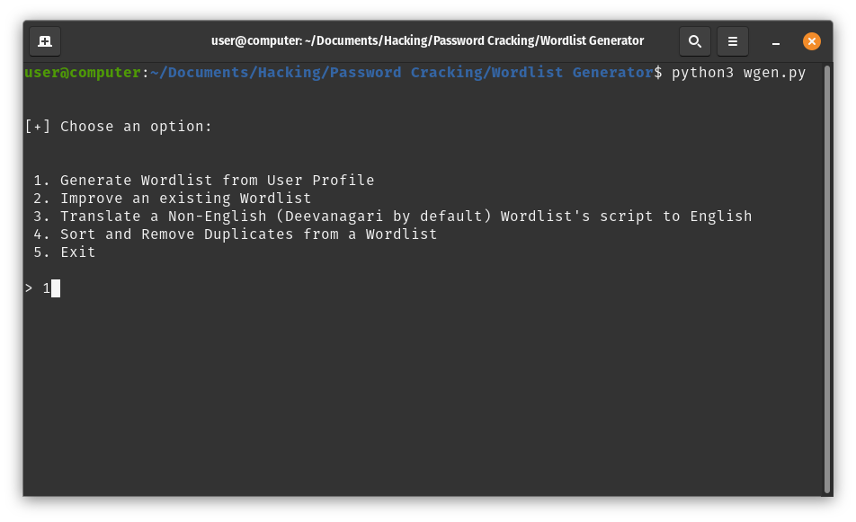
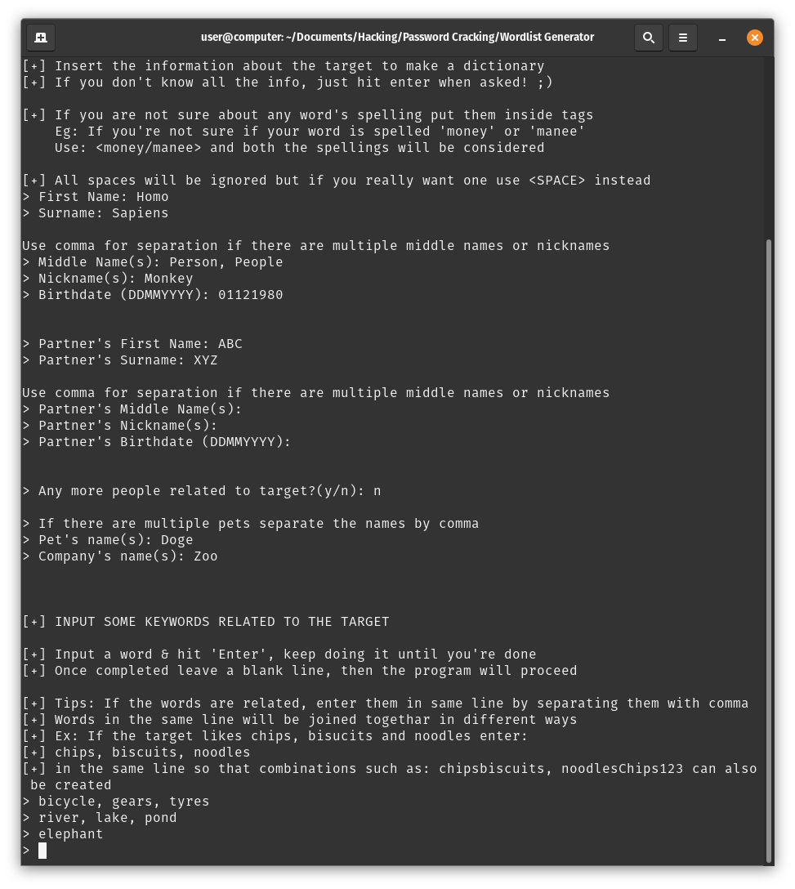
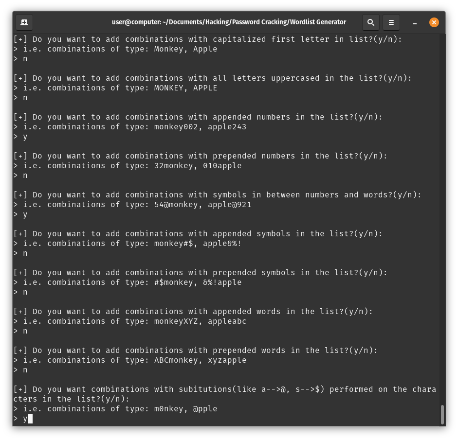
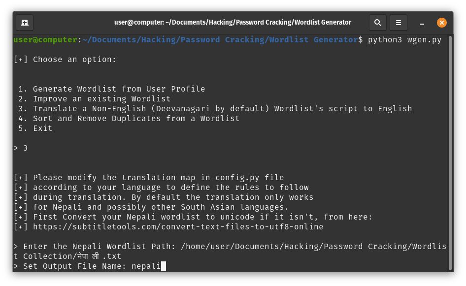

# WGen

Inspired by the classic pentesting tool cupp.py, WGen adds extra features and prompts to it in order to solve many inconveniences that come with it. This command-line tool allows pentesters to generate wordlists that are highly personalized based on their target info, which can assist when cracking target's passwords.

**Disclaimer**: This tool is only intended to be used for security testing purpose. Developers of this tool will not be held responsible for any misuse of it.

# Features

1. Generates a personalized list of possible passwords based on the target's name, birthdate, people related to the target and other words related to them.

 

2. Wide range of prompts to choose, for formatting your passwords the way you need.

 

3. If your targets uses languages other than English you can use the tool for translating the script of their Non-English passwords into English. By default the tool can easily convert Nepali wordlist's script into English, and should also work very well for other South-Asian languages that follow Deevanagari Script.
     But you'll probably be able to make this work for many other languages too, if you review the `translation_map` dictionary in config.py file and make modifications as per your need.

     **Example**: Using this option, you can generate words 'kaanoon', 'kaanun', 'kanuna' etc. out of the word 'कानुन', which are it's possible translations in English script.

# Usage
**For Windows Users:**

    python wgen.py

**For LINUX / Mac Users:**

    python3 wgen.py

Follow the prompts and the output wordlist as per your neeed will be generated out in the same folder.

If you want more customization, you can adjust parameters in **'config.py'** file according to your choice, to make modifications such as: append/prepend new numbers/symbols/letters to the password, change script translation rules, change letter substitution rules etc.
